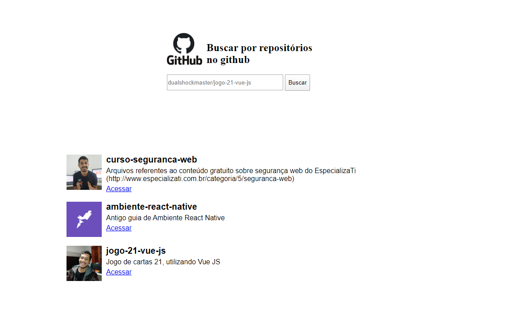

<h1 align="center">Busca de repositórios do github ultizando Javascript</h1>

 Bom faz um tempinho que queira dar uma estudar em Javascript "Puro", e dei de cara com um curso free da rockseat, onde detalha muito bem, 
 as novas funcionalidades e melhorias da linguagem, vale muito a pena conferir
 além de explicar as noções básicas, no final do curso é realizado esse projeto de busca de repositorios do github, dei algumas costumizadas
 porém nada demais.

